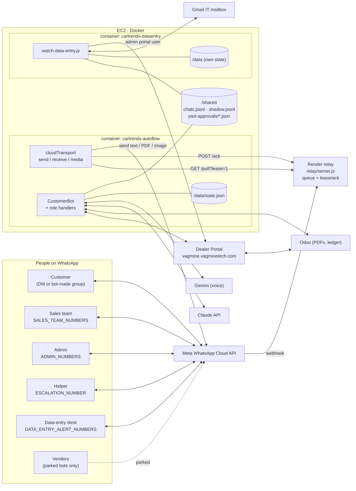
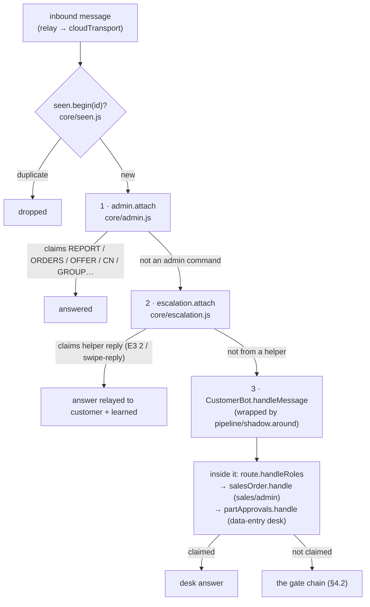
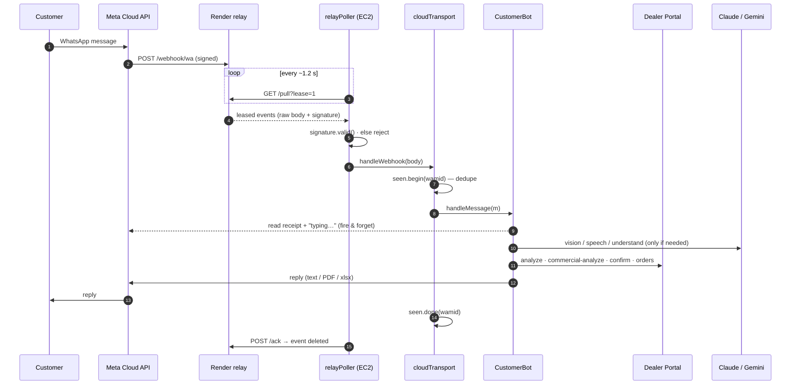
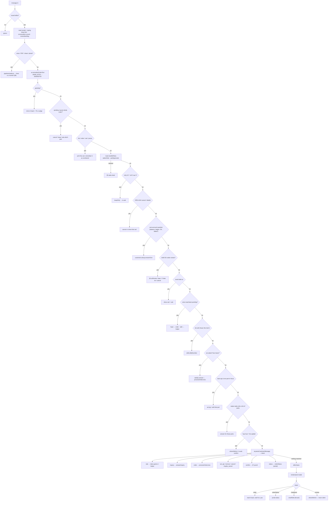
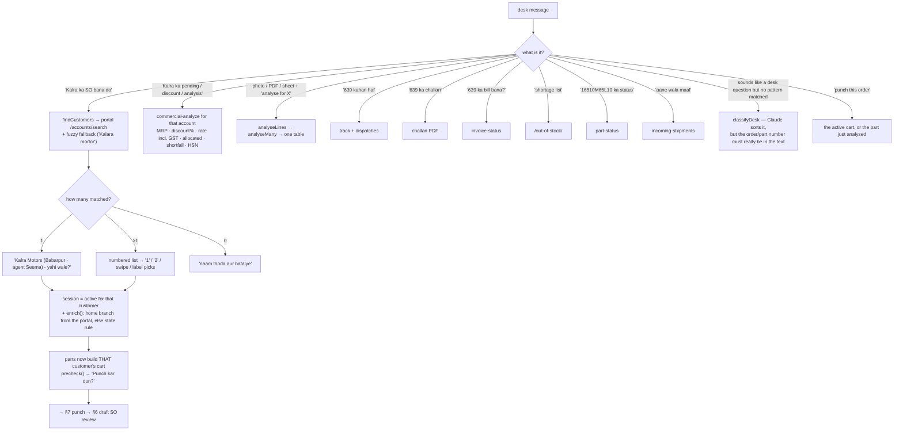
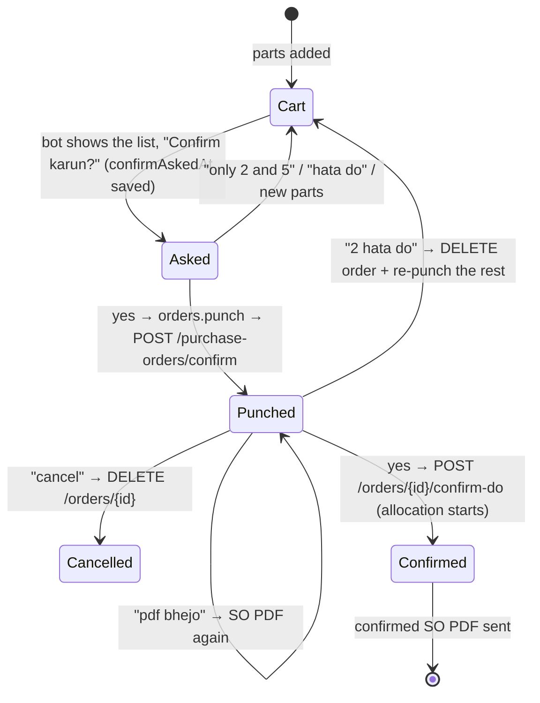
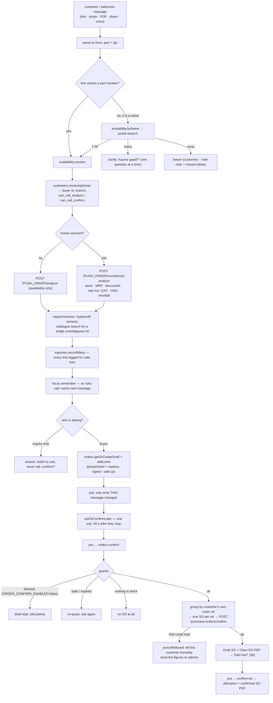
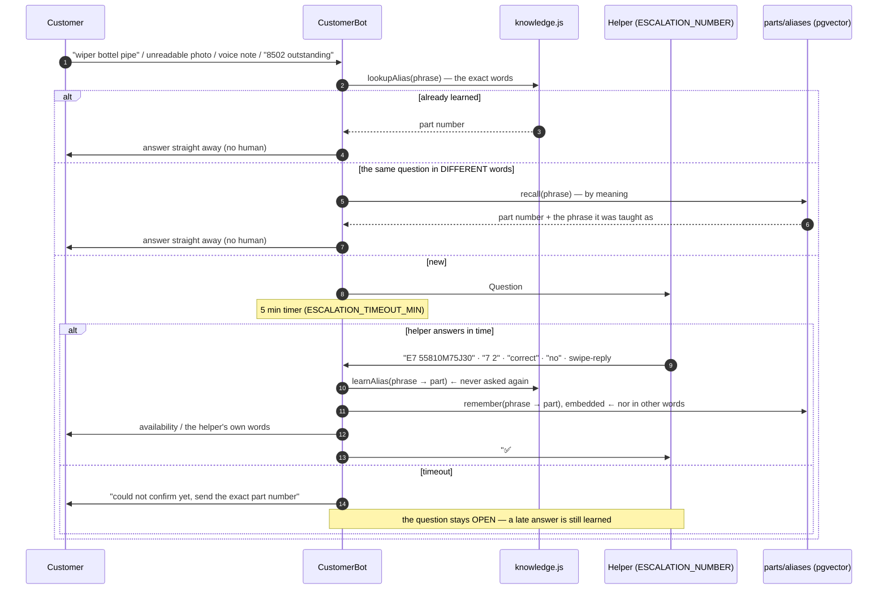
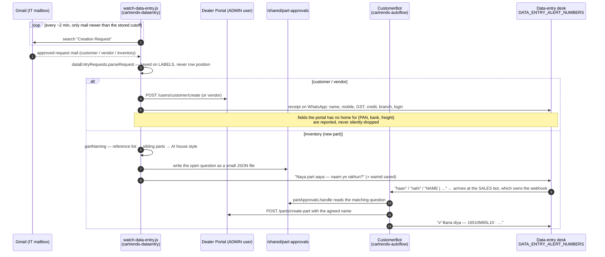
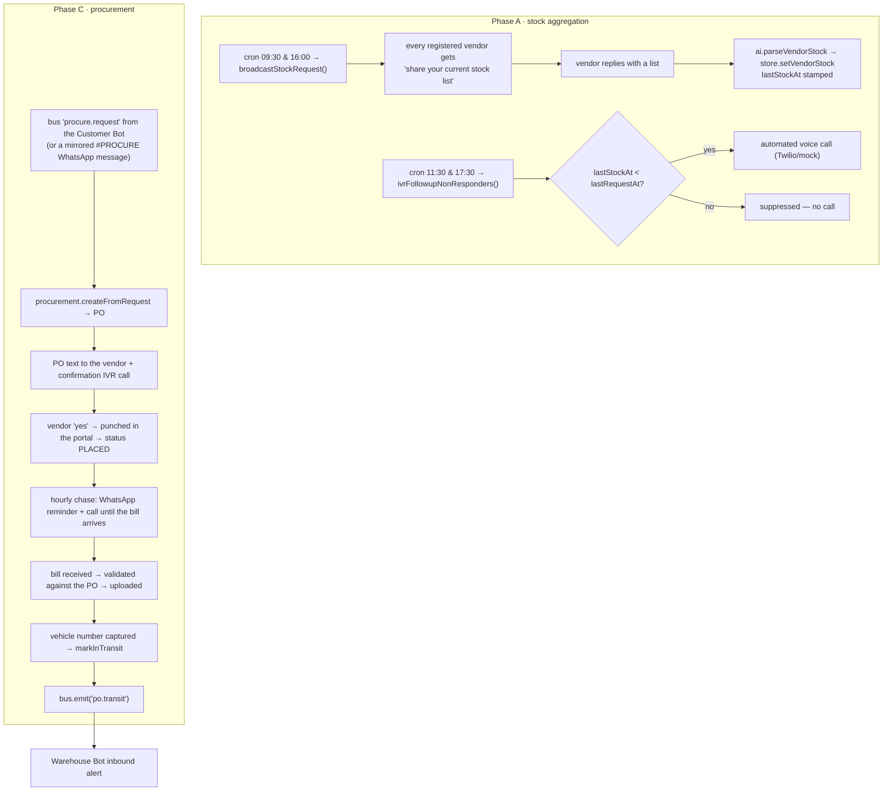

# Cartrends AutoFlow — Every Agent, What It Does, and How the Data Moves

A build-level walkthrough of the whole system: every bot and agent-like module, who it
talks to (customer / vendor / sales team / admin / helper / other agents), what state it
owns, and the end-to-end data flow. Written against the code as it stands, with
`file:line` references so you can jump straight to any claim.

---

## 0. The one thing to get straight first

The README describes a **five-bot** system (customer, purchase, warehouse, finance,
helpdesk). That is the *design*. What actually boots today is **one bot**:

```js
// src/index.js:18-28
function buildBots() {
  const bots = { customer: new CustomerBot() };
  if (!config.enableExtraBots) return bots;      // ENABLE_EXTRA_BOTS=false by default
  bots.purchase  = new (require('./bots/purchaseBot'))();
  bots.warehouse = new (require('./bots/warehouseBot'))();
  bots.finance   = new (require('./bots/financeBot'))();
  bots.helpdesk  = new (require('./bots/helpdeskBot'))();
  return bots;
}
```

So there are two different populations to understand, and I treat them separately:

| Population | What it is | Status |
|---|---|---|
| **Live agents** | The Customer/Sales Bot plus ~8 agent-like modules that run *inside* its process (sales desk, admin, escalation, part approvals, understand model, small talk, media readers) | Running in production on EC2 |
| **Parked bots** | Purchase (414), Warehouse, Finance, Helpdesk — full classes, wired to the event bus, **not started** | Dormant. See §11 — they will not run as written any more |
| **Second container** | The data-entry mailbox watcher — a real autonomous agent, separate process | Running |

"Agent" in this codebase is not one uniform thing. There are four kinds:

1. **Bots** — a class with a WhatsApp transport and a `handleMessage` (`src/bots/*.js`).
2. **Role handlers** — modules that claim a message before or inside the bot and own a
   whole conversation type (`admin.js`, `escalation.js`, `salesOrder.js`,
   `partApprovals.js`, `soReview.js`).
3. **Model agents** — one LLM call with a fixed contract and hard guards
   (`pipeline/understand.js`, `core/smallTalk.js`, `core/ai.js` vision,
   `integrations/speech.js`, `customerLookup.classifyDesk`).
4. **Human agents** — real people the system delegates to over WhatsApp: the helper
   (`ESCALATION_NUMBER`), the voice helper, the data-entry approver. They are addressed
   with a protocol (`E3 2`, `E3 55810M75J30`) and their answers are learned permanently.

---

## 1. System map



**Why the relay exists:** EC2 publishes no inbound ports. Meta posts webhooks to a tiny
Render service; the bot *pulls* them outbound. A pulled message is only **leased**
(`relay/server.js:113-126`) and deleted only after the bot **acks** it
(`relay/server.js:129-150`). Crash mid-message → the relay offers it again. Three
failures → dropped so one bad payload cannot block the line
(`src/wa/relayPoller.js:88-95`).

**Why two containers:** `store.js` rewrites `state.json` whole on every save, so two
processes cannot share it. The watcher also logs into the portal as the **admin** user
while the bot uses the **sales** user (`config.js:110-115`). They share only `/shared`.

---

## 2. The agent cast, at a glance

| # | Agent | File | Kind | Talks to | Live? |
|---|---|---|---|---|---|
| 1 | **Customer Sales Bot** | `src/bots/customerBot.js` (2226 ln) | Bot | Customer, sales team, admin, groups | ✅ |
| 2 | **Sales Desk agent** | `src/core/salesOrder.js` (1485 ln) | Role handler | Salesman, admin | ✅ |
| 3 | **Admin agent** | `src/core/admin.js` | Role handler | Admins only | ✅ |
| 4 | **Escalation agent** | `src/core/escalation.js` (740 ln) | Role handler + human bridge | Helper ⇄ customer | ✅ |
| 5 | **SO Review agent** | `src/core/soReview.js` | Sub-flow | Whoever punched the SO | ✅ |
| 6 | **Part-Approval agent** | `src/core/partApprovals.js` | Role handler (cross-container) | Data-entry desk | ✅ |
| 7 | **Understand model** | `src/pipeline/understand.js` + `shadow.js` | Model agent | Nobody — advises the bot | ✅ |
| 8 | **Small-talk agent** | `src/core/smallTalk.js` | Model agent | Customer (fenced) | ✅ |
| 9 | **Media readers** | `src/pipeline/media.js`, `core/ai.js`, `integrations/speech.js`, `core/sheet.js`, `core/documents.js` | Model/tool agents | — | ✅ |
| 10 | **Desk classifier** | `customerLookup.classifyDesk` | Model agent | — | ✅ |
| 11 | **Data-entry watcher** | `scripts/watch-data-entry.js` | Autonomous agent, own container | Gmail, portal, data-entry desk | ✅ |
| 12 | **Scheduler** | `src/core/scheduler.js` | Cron | Admins (daily report) | ✅ |
| 13 | **Purchase Bot** | `src/bots/purchaseBot.js` | Bot | Vendors, IVR, Customer Bot | ⛔ parked |
| 14 | **Warehouse Bot** | `src/bots/warehouseBot.js` | Bot | Pickers, warehouse team | ⛔ parked |
| 15 | **Finance Bot** | `src/bots/financeBot.js` | Bot | Customers (dues) | ⛔ parked |
| 16 | **Helpdesk Bot** | `src/bots/helpdeskBot.js` | Bot | Employees | ⛔ parked |

---

## 3. How a message reaches an agent (the claim chain)

Several agents listen on the **same** transport. Whoever returns `true` first **claims**
the message and nobody after them sees it (`src/wa/transport.js:24-28`):

```js
async function dispatch(handlers, m) {
  for (const fn of handlers) { if ((await fn(m)) === true) return; }
}
```

Registration order is fixed in `src/index.js:52-66` and **is** the priority order:



Three consequences worth remembering when you extend this:

* An **admin command always wins** — an admin typing `ORDERS` never reaches the order flow.
* A **helper's reply wins over everything else**, which is why a bare sentence from the
  helper is *not* relayed unless it was a swipe-reply or `#id …`
  (`escalation.js:663-667`, `backOut` at `:576`).
* If you ever run several bots on one number, boot order decides who gets the message —
  helpdesk is deliberately last because it is the catch-all (`transport.js:6-12`).

### 3.1 One message, end to end



---

## 4. Agent 1 — the Customer Sales Bot (the only live bot)

`src/bots/customerBot.js`. This is the person who used to sit reading WhatsApp: it reads
orders from text, photo, PDF, Excel and voice; asks the Dealer Portal what exists; holds
a draft cart; punches the SO; and answers status. It holds **no stock of its own** —
every availability answer is a portal call.

### 4.1 Who it will even listen to

`src/pipeline/route.js` decides this *before* anything else:

| Check | Rule | Code |
|---|---|---|
| DM | Only numbers in `CUSTOMER_DMS` (or `all` for testing) | `route.js:15` |
| Group | **Only groups the bot itself created** — being added to a random company group can never make it start answering | `route.js:19` |
| Own numbers | Messages from any bot number are ignored | `route.js:56-58` |
| Staff in a group | Admin / `GROUP_DEFAULT_MEMBERS` / helper talking in a group are humans talking to the customer — never read as an order and never as the customer's "yes" | `route.js:60-67` |
| Inquiry-only | `INQUIRY_ONLY_NUMBERS`, **and** any sales-team number until it names a customer | `route.js:32-37` |

That last one is subtle and important: company SIMs are saved on customer accounts on the
portal (9217030422 is both Agent Hajra and M/S Maan Motors), so a salesman's parts would
otherwise land in *that* customer's cart. A salesman is inquiry-only until
`salesOrder.activeCustomer(chatId)` exists.

### 4.2 The gate chain inside `handleMessage`

Rules first, model last. The first gate that settles the message replies.



**The Phase-4 rule** (`customerBot.js:1628-1647`): where a *gate* would have sent chatter
to a human and the *model* says it is plain conversation, the model wins. Where a gate
would have dropped something the model reads as an order, the bot **reads it back** and
waits for a yes. `afterGates` guarantees a reply — the founder's "bot kabhi silent na
ho". The only message allowed to go unanswered is a bare `ok` / `achha` / 👍
(`JUST_ACK`, `customerBot.js:140`).

### 4.3 Per-chat memory the gates depend on

Everything is keyed by **chatId**, so two customers never mix
(`core/chatState.js` slots, all inside `state.json`):

| Slot | Meaning | Owner |
|---|---|---|
| `orders[]` with `status:'draft'` | the cart | `core/orders.js` |
| `confirmAskedAt` on the draft | "we asked, so a yes is a yes" | `orders` / `customerBot` |
| `soReview` | a punched draft SO waiting for "Sahi hai?" | `core/soReview.js` |
| `askQty.pending` / `lastAnswered` | "how many?" is open | `core/askQty.js` |
| `clarify.pending` / `lastAsked` | "kaunsi gaadi?" is open | `core/clarify.js` |
| `voiceOrder` | a read-back waiting for yes | `core/voiceOrder.js` |
| `cancelAsk` | "cancel the whole order?" (5 min) | `customerBot.js:81` |
| `focus` | the parts just discussed → resolves "iska rate" | `core/focus.js` |
| `quotable` | last 40 messages each way, by wamid → swipe-replies | `customerBot.js:88` |
| `numberedLists` | the numbered list we sent → "leave 9no. item" | `core/lists.js` |
| `sales.session` / `sales.discussing` / `sales.lastList` / `sales.fileAnalysis` | the desk's context | `core/salesOrder.js` |
| `lang` | which language this chat writes in | `core/lang.js` |

**Nothing that must survive lives in a timer.** SO 626 was punched because a
"Confirm karun?" lived only in a `setTimeout` and a deploy killed it; now the ask is
written to disk (`customerBot.js:1396-1399`).

---

## 5. Agent 2 — the Sales Desk (`core/salesOrder.js`)

This is a second, quite different conversational agent that runs **inside** the customer
bot's handler, claimed by `route.handleRoles` for anyone in `SALES_TEAM_NUMBERS` or
`ADMIN_NUMBERS`, in DMs only.



Rules that make the desk different from a customer:

* A desk user's unknown part **never** goes to the helper. They get "portal pe nahi mila"
  plus the closest catalogue numbers **with live stock** (`customerBot.nearParts`,
  `:1655`; used at `:2012-2031`).
* Money questions (MRP, discount, rate, GST) are answered directly — a customer's are not.
* An admin with no customer named punches on **the account of the admin's own number**.
* The desk's rate answers use the **customer being discussed**, not the salesman's own
  account (`route.onBehalfOf`, `customerBot.js:767`).

---

## 6. Agent 3 — the SO Review (`core/soReview.js`)

The second confirmation, and the reason nothing is ever allocated by accident.



Why removal is a cancel + re-punch: `PUT /orders/{id}` returns 200 and **silently ignores
the change** (tested on orders 632/633) — so the order is deleted and what is left is
punched again (`soReview.js:294-335`).

Safety rules encoded here and in the confirm gate:

| Rule | Where |
|---|---|
| Nobody's first message ever punches — two yeses are needed | `customerBot.js:1077-1088` |
| A **stale yes is refused**: if the bot said anything else since asking, it shows the list and asks again (this is what punched SO 687) | `customerBot.js:1056-1070` |
| **One-punch lock** — two yeses in the same second cannot punch twice | `orders.js:270-286` |
| A yes to "cancel the whole order?" is a cancel, not an order | `customerBot.js:1012-1024` |
| In a **group**, only an unmistakable yes counts (`ok` alone is not one) | `customerBot.js:1029-1036` |
| Quantities re-checked at confirm; if stock moved, re-quote and wait for a fresh yes | `orders.js:311-334` |
| Only what is **in stock**, at the quantity in stock, is punched | `orders.js:347-357` |
| The portal's own line list is compared with what we sent → "⚠️ Ye portal pe order nahi hue" | `customerBot.js:1237-1250` |

---

## 7. The order data flow, end to end



**Sale-loss data** (`core/inquiries.js`) is written on *every* requested line whatever the
outcome — that is what `LOSS` and the daily report read.

---

## 8. Media agents — photo, PDF, sheet, voice

`src/pipeline/media.js` runs before any text handling and each branch ends the message
itself (order placed, human asked, or a reply).

| Input | Reader | Then |
|---|---|---|
| **Voice note** | Gemini (`integrations/speech.js`); Claude takes no audio | 1) if it swipe-replies one of our numbered lists and sounds like an edit → apply it. 2) else `heardOrder`: every part must be in the catalogue, then **read back** → "sahi hai?". 3) else the recording + transcript go to the **voice helper** |
| **Photo** | Claude vision (`ai.parseOrderImage`); optional local OCR on Windows | Caption part number beats the box's number; caption qty fills missing qty. Desk + "analyse for X" → analysis. Unreadable → helper, **with the photo attached** |
| **PDF** | pdfplumber text, else render pages → vision | same line parser as typed text |
| **Excel / CSV** | `core/sheet.js` grid reader | large orders get an **xlsx reply back**, not a 70-line bubble |
| **GST invoice photo** | vision says `docType` | refused as an order — "Invoice No 2939" can never become qty 2939 |

Everything then converges on the **same** `processOrderLines`, so a photo order and a
typed order produce an identical draft.

---

## 9. Agent 4 — Escalation: the human-in-the-loop, with permanent learning

`src/core/escalation.js`. This is the only place the system hands work to a person, and
the only place it *learns forever*.



Design details worth knowing before you touch it:

* **Six different question shapes**, because they are different jobs:
  `NOT_IN_CATALOGUE`, `NO_PART_NUMBER`, `UNREADABLE`, `DOCUMENT`, `VOICE`, `NOT_A_PART`,
  `RATE` (`composeAsk`, `:143-243`).
* **Learned twice, on purpose.** The string key in `state.json` answers the wording it
  was taught; `core/parts/aliases` embeds the same phrase so the next customer only has
  to *mean* the same thing. Without the second one, "swift ka clutch plate chahiye" was
  answered and "clutch plate for swift dzire, 2 pcs" went back to the helper a week
  later. It refuses where it cannot be sure — below threshold, a near-tie between two
  remembered parts, a different size, or a brand the customer named that the remembered
  phrase does not carry — and every refusal is the old behaviour: ask a person.
  Inspect and prune with `GET`/`DELETE /api/parts/aliases`; tune with
  `POST /api/parts/aliases/search`.
* **Only part questions are teachable.** Teaching the bot that "voice note" means
  55810M75J30 would poison every future voice note (`:271`).
* `VOICE / DOCUMENT / RATE / NOT_A_PART` answers are **relayed as written** — the helper
  is writing a sentence for the customer, not a part number (`:663-667`).
* "correct" means *the number is right, we just do not stock it* → `markOnOrder` → the
  customer hears "on order, ETA = 7 days" and nobody is asked again (`:690-711`).
* Open questions are **persisted and rehydrated** across restarts (`:751-781`).
* Never escalated: sales team and admin questions, desk money questions, desk file
  analysis, anything the model reads as plain chat.

---

## 10. Agent 5 — Data entry: mailbox → portal → WhatsApp approval (cross-container)

This is the clearest agent-to-agent flow in the system, and it spans **two containers**
through the `/shared` directory.



Two things this design solves: the watcher can **ask** but cannot **hear** (only the sales
container receives webhooks), and `state.json` cannot be shared — hence one small file per
open question in `/shared/part-approvals` (`core/partApprovals.js:25-40`).

Guards: the cutoff is **remembered on disk** so a restart cannot skip mail that arrived
during a rebuild, rewound 5 minutes for overlap (`watch-data-entry.js:38-56`); creation is
off unless `--create` / `MAIL_AUTO_CREATE=true`.

---

## 11. The parked bots — what they were built to do (and their current state)

These do not boot. Read this section as *design intent plus a repair list*.

### 11.1 Purchase Bot (line 414) — the vendor-facing agent



The `#PROCURE SO-123 | VENDOR: Northend | Brake Pad x 5` WhatsApp mirror
(`purchaseBot.js:196-216`) exists so the bots can later run as separate processes without
code changes — the bus is the source of truth, WhatsApp is the audit trail.

### 11.2 Warehouse Bot

* `bus.on('po.transit')` → inbound/GRN alert to `WAREHOUSE_TEAM_NUMBERS` with lines and
  vehicle number.
* `DO <SO#>` (or a portal webhook, when it exists) → picklist with shelf locations to the
  registered picker.
* `REGISTER PICKER` enrols a picker; `DONE <SO#>` closes the task.
* GRN verification stays human **by design**.

### 11.3 Finance Bot

* Daily 10:00 reminders from `invoicesOutstanding` where `dueDate <= today`.
* `STATEMENT` → that number's ledger lines + total.

### 11.4 Helpdesk Bot

* Every employee DM becomes a ticket, auto-classified IT (`laptop|wifi|printer…`) vs HR,
  with an id. Never tickets vendors, bots, warehouse numbers or admins — it is the
  catch-all on a shared line, so it deliberately runs last.

### ⚠️ Current state of the parked path

Flipping `ENABLE_EXTRA_BOTS=true` today will **not** reproduce the README flow:

1. **Nothing emits `procure.request` any more.** `purchaseBot` still listens
   (`purchaseBot.js:31`), but no module emits it — the order split was removed when the
   Dealer Portal took ownership of everything after the punch (`orders.js:6-8`). So
   customer → purchase is a dangling wire.
2. **Four portal methods the parked bots call no longer exist** in
   `integrations/dealerPortal.js`: `createPurchaseOrder` (`procurement.js:50`),
   `uploadInvoice` (`:81`), `markInTransit` (`:90`), `getPicklist`
   (`warehouseBot.js:43`). Those calls would throw `TypeError`.
3. Vendor stock now reaches the portal from **ProcureHub**, not from WhatsApp
   (`config.js:24-28`), so Phase A duplicates a pipeline that already exists elsewhere.

If you want the vendor side back, the work is: re-emit `procure.request` from
`orders.punch` for out-of-stock lines, and re-implement those four portal calls against
the current API. Nothing else in the parked bots depends on removed code.

---

## 12. Who can do what (the permission matrix the code actually enforces)

| | Ask stock | Build a cart | Punch an SO | Money answers | Reaches the helper | Admin commands |
|---|---|---|---|---|---|---|
| **Customer** (on `CUSTOMER_DMS`, portal account) | ✅ | ✅ | ✅ (own account, two yeses) | own ledger/CN/balance only | ✅ | ✗ |
| **Sales team** | ✅ | only after naming a customer | ✅ for that customer | ✅ direct (MRP, discount, rate) | ✗ never | ✗ |
| **Admin** | ✅ | ✅ | ✅ named customer, else own number's account | ✅ | ✗ | ✅ |
| **Helper** | — | — | — | — | is the destination | only if also admin/sales |
| **Data-entry desk** | — | — | — | — | — | answers part-name questions |
| **Staff in a group** | ignored — treated as humans talking to the customer | | | | | |
| **Unregistered number** | ✅ (answered) | ✅ (kept) | ✗ "account not registered — team will set it up" | ✗ | ✅ | ✗ |

---

## 13. State and storage ownership

| Data | Where | Survives restart | Written by |
|---|---|---|---|
| Carts, placed orders, SO reviews, open questions, active customer, chat memory, seen-message ids, escalation queue | `/data/state.json` (atomic temp+rename) | ✅ | `src/store.js` |
| Learned phrase → part, "valid but not stocked", human notes | `knowledge` inside `state.json` | ✅ forever | `core/knowledge.js` |
| The same phrase → part, **embedded**, so a rewording is recalled instead of re-asked | `bot_part_aliases` (Postgres + pgvector, migration 004) | ✅ forever | `core/parts/aliases.js` |
| Every message in and out (+ media) | `/shared/chats.jsonl` (rotates) | ✅ | `core/chatLog.js` |
| Model-vs-gate decisions | `/shared/shadow.jsonl` (rotates, 20 MB) | ✅ | `pipeline/shadow.js` |
| Open "naam ye rakhun?" questions | `/shared/part-approvals/*.json` | ✅ | both containers |
| Undelivered WhatsApp messages | Render relay queue (leased until ack) | ✅ | `relay/server.js` |
| Greeting nudge, confirm nudge, escalation timeout | memory only | ✗ **by design** — anything that must survive is mirrored into `state.json` | |
| Portal / Odoo tokens | memory; credentials in EC2 `.env` | ✗ re-login on start | `dealerPortal.js` |

---

## 14. External systems the agents use

**Dealer Portal** (`/api/v1`, sales user) — the single source of stock and the only place
orders are punched:

| Purpose | Endpoint |
|---|---|
| Part match / stock | `GET /search`, `POST /PUSH_ORDER/analyze` |
| Price for an account | `POST /PUSH_ORDER/commercial-analyze` |
| Who is this number | `GET /users/customer/mobile`, `GET /PUSH_ORDER/order-for-user` |
| Customer by name | `GET /accounts/search` |
| Punch (draft SO) | `POST /purchase-orders/confirm` |
| Confirm (allocate) | `POST /orders/{id}/confirm-do` |
| Cancel | `DELETE /orders/{id}` |
| Order detail / history | `GET /orders/{id}`, `GET /orders/?buyer_search=` |
| SO / bill PDF | `/odoo/documents/so/pdf`, warehouse invoice |
| Track · dispatch · challan · bill status | `/api/orders/track/{id}`, `/warehouse/*` |
| Shortage · part history · incoming | `/out-of-stock/`, `/masterpurchase/part-status/{part}`, `/warehouse/incoming-shipments` |
| Credit control (on 409) | `GET /accounts/{id}/credit-control` |
| Create customer / vendor / part | `/users/customer/create`, `/users/vendor/create`, `/parts/create-part` — **admin user only** |

**Others:** Meta Graph API (send/receive, media download), Claude (understand, vision,
line parsing, desk classifier, small talk, part naming), Gemini (voice), Odoo (SO/bill
PDFs, ledger, credit notes), Gmail (data-entry mailbox), Twilio/mock IVR (parked).

**403 for the sales user:** MIS sales, dealer sales summary, part locations, complaints,
POS stock — those need a separate portal user.

---

## 15. How the AI is fenced (worth knowing before you add a model anywhere)

Every model in this system can **pick, never invent**:

| Agent | Fence | Code |
|---|---|---|
| Understand | a part number it returns must already appear in the message, hints, cart, discussion or recent turns — otherwise it is dropped; a message ending in `?` can never be a confirm or a cancel | `understand.js:102-148` |
| Small talk | may not quote a rate, part number or stock; may not confirm/place/cancel; may not promise a date. A reply that trips a fence is thrown away and the bot falls back to `whereWeAre` | `smallTalk.js:11-23` |
| Desk classifier | the order/part number it names must really be in the message | `customerLookup.js:386-400` |
| Vision | a GST invoice is refused as an order; qty is capped; header words are never items | `pipeline/media.js`, `ai.VISION_PROMPT` |
| Profile polish | `profiles.polish` throws its own output away if a digit or a part number moved | `core/profiles.js` |
| Shadow | runs **after** the handler, its result goes only to a log file, every failure is swallowed | `shadow.js:225-258` |

---

## 16. Open items / where it can bite

1. **Parked bots will not run as written** — see §11 (dangling `procure.request`, four
   missing portal methods).
2. **One portal session per user** — a replay or sandbox on EC2 logs the live bot out
   (401 `SESSION_INACTIVE`). Use a separate test portal user.
3. **Odoo SO PDF is missing for many orders**, so a draft SO sometimes goes out as a text
   list instead of a document.
4. **Groups must be bot-created** — existing customer groups get no replies at all.
5. **Webhook signature check is built but off** until `WA_APP_SECRET` is set; the relay
   must also be running the newer build that forwards the raw body.
6. **Salesman messages inside customer groups** are currently ignored as staff — whether
   they should count as the customer's order is still a product decision.
7. `parseOrderFor` + fuzzy search means a salesman's typo picks a *customer*; always check
   the "Which one?" list before confirming.

---

## 17. If you only remember five things

1. **One process, one live bot.** Everything else that behaves like an agent is a module
   inside it, claimed through one ordered handler chain: admin → helper → bot → desk.
2. **Rules first, model last.** The model never speaks unless the deterministic gates
   declined, and it can only pick from what is already on the table.
3. **Two yeses, or no order.** List + "Confirm karun?" → draft SO + "Sahi hai?" →
   `confirm-do`. Any bot message in between invalidates the first yes.
4. **The portal is the truth.** No local stock, no local prices, no local order state —
   only the cart and the conversation live here.
5. **Every human answer is learned once, forever.** That is what stops the helper from
   being asked the same question twice, and it is the single highest-leverage loop in the
   system.
