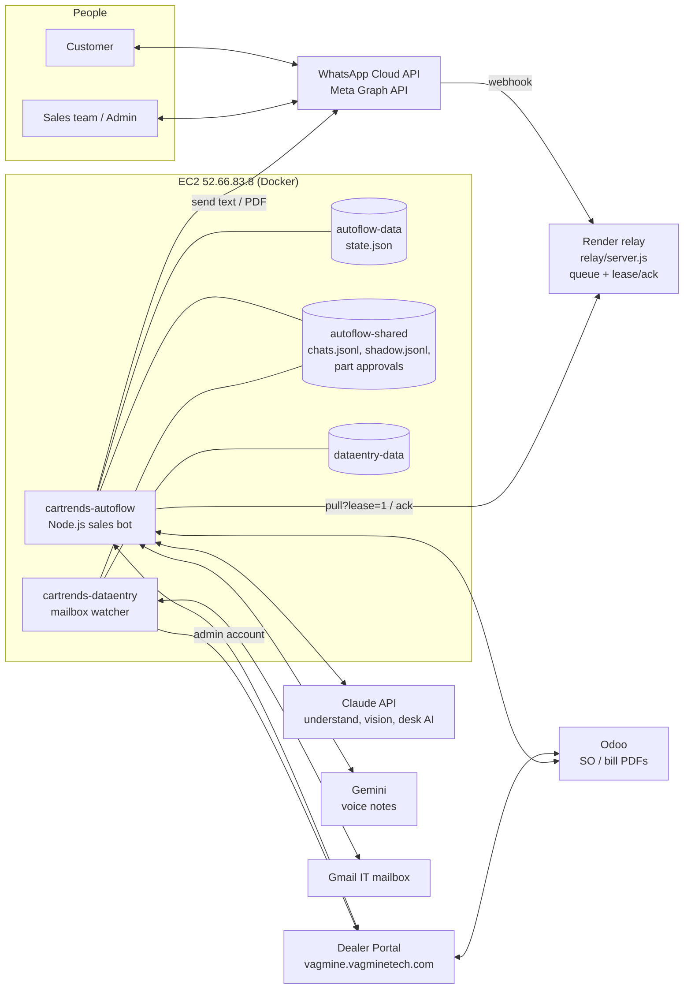
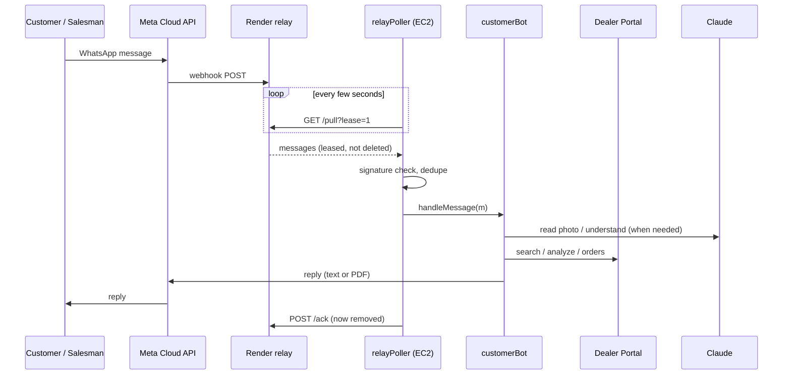
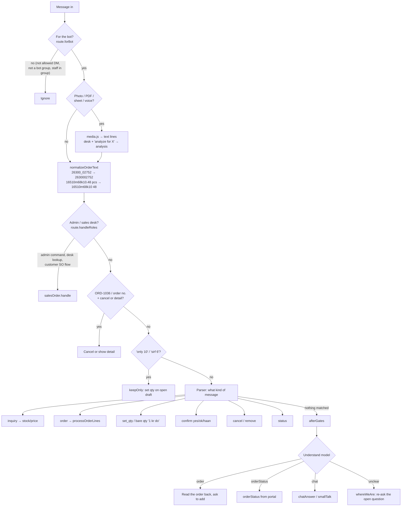
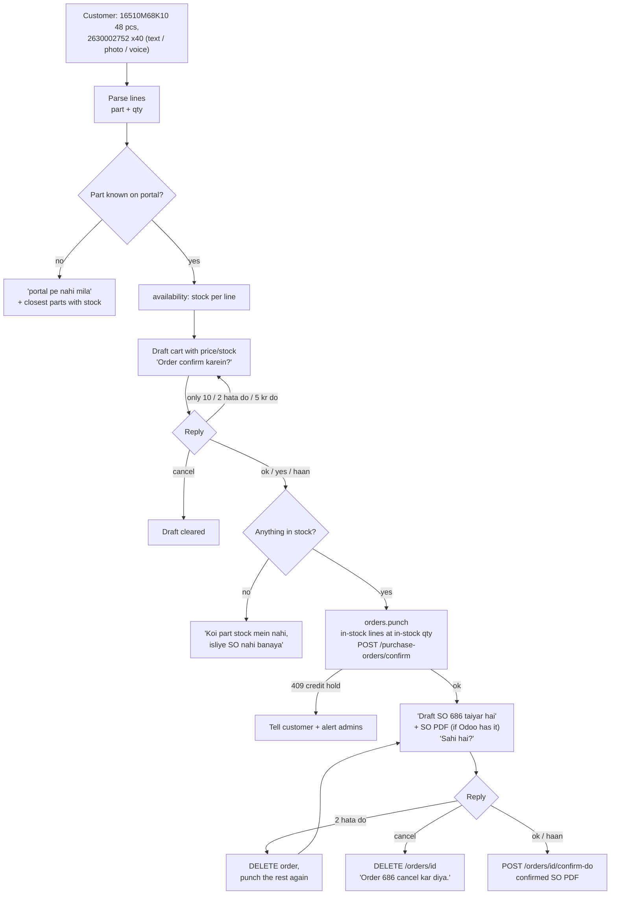
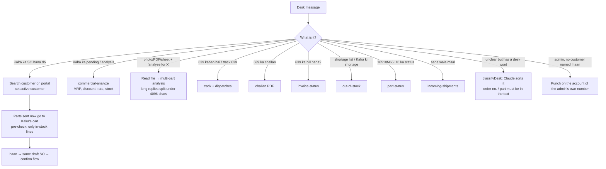
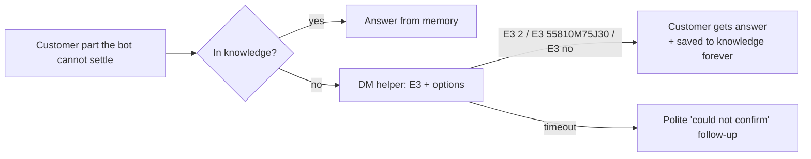

# Cartrends AutoFlow: Summary, Flow and System Design

* Live on EC2 52.66.83.8, container `cartrends-autoflow`.*

---

## 1. Summary

AutoFlow is the Cartrends **WhatsApp sales bot**. Customers, the sales team and admins message one WhatsApp number. The bot:

- reads orders from **typed text, photos (printed and handwritten), PDFs, Excel sheets and voice notes**;
- checks **stock, MRP, discount and rate** on the Dealer Portal (the portal price and MRP already include GST);
- builds a **draft order**, asks the customer, punches a **draft SO**, sends it, asks again, and **confirms only on "ok" / "haan"**;
- punches **only the parts in stock, at the qty in stock** (founder, 14 Sep). ETA and "on order" appear only when someone asks about stock;
- answers **order status** from the portal ("639 kahan hai");
- gives the **sales desk** (admins and the sales team) what they would otherwise open the portal for: customer analysis, file analysis, challan PDF, bill status, shortage list, part status and incoming stock;
- **never goes silent**, and never sends salesman or admin money questions to a human.

What it replaced: a person reading every WhatsApp message, searching the portal part by part, typing the SO, and sending PDFs by hand.

### Status

| Area | Status |
|---|---|
| Customer DM and bot-created groups | Live |
| Order punching (`ORDER_CONFIRM_ENABLED=true`) | Live since 14 Sep 08:28 UTC |
| Draft SO → confirm SO flow | Live |
| Photo / handwriting / PDF / sheet reading (Claude vision) | Live |
| Voice notes (Gemini speech-to-text) | Live |
| Sales desk: customer SO, analysis and lookups | Live |
| Understand model (Phase 4 hybrid: gates first, model decides the rest) | Live |
| Data-entry watcher (customers / vendors / parts from the IT mailbox) | Live, separate container |
| Purchase / warehouse / finance / helpdesk bots | Parked (`ENABLE_EXTRA_BOTS=false`) |
| Webhook signature check | Built; needs `WA_APP_SECRET` to turn on |
| Odoo SO PDF for every order | Depends on the portal's Odoo sync (see §9) |

---

## 2. Who uses it

| Who | How the bot knows | What they can do |
|---|---|---|
| **Customer** | Number is on a portal account; DMs allowed by `CUSTOMER_DMS` | Ask stock/price, order, confirm, cancel, ask status |
| **Sales team** | `SALES_TEAM_NUMBERS` (23 numbers) | Ask anything. Orders only after naming a customer ("Kalra ka SO bana do"). Until then they are inquiry-only, because many sales SIMs are also saved on customer accounts |
| **Admin** | `ADMIN_NUMBERS` | Everything the sales team can do, plus admin commands (REPORT, ORDERS, GROUP, CUSTOMER ADD, OFFER, CN…). An admin's "haan" punches for the named customer, or for the account on the admin's own number |
| **Helper** | `ESCALATION_NUMBER` / `VOICE_ESCALATION_NUMBER` | Answers the few customer questions the bot cannot settle (`E3 2`, `E3 55810M75J30`); the answer is remembered for good |
| **Group members** | Only groups the bot created (`GROUP name \| numbers`) | Same flow as a DM. Staff messages in a group are treated as human talk, never as the customer's order or "yes" |
| **Data-entry alerts** | `DATA_ENTRY_ALERT_NUMBERS` = 7701919954 only | Gets data-entry request alerts |

---

## 3. System design

### 3.1 Components

**Why a relay?** The EC2 host publishes no ports. Meta posts webhooks to a small relay on Render; the bot pulls them outbound. A message is only **leased**, and it is removed from the relay only after the bot **acks** it as handled. If the bot dies mid-message, the relay offers it again, so no message is lost across restarts. A message that fails 3 times is dropped so it cannot block the line.

**Why two containers?** `store.js` rewrites `state.json` whole on every save. Two processes sharing one state file would overwrite each other. The data-entry watcher also runs as the **admin** portal user, while the bot runs as the **sales** user. They share only `/shared`.

**Host limits** (16 containers on 2 vCPU / 7.8 GB): the bot is capped at 512 MB and 0.5 CPU, the watcher at 256 MB and 0.25 CPU. Logs rotate at 10 MB × 3. The console binds to `127.0.0.1:3010` and is opened over an SSH tunnel only.

### 3.2 Code map

| Layer | File | Job |
|---|---|---|
| Entry | `src/index.js` | Boots the customer bot, admin commands, escalation, scheduler, relay poller |
| Config | `src/config.js` | Reads `.env` (numbers, portal, AI keys, flags) |
| Intake | `relay/server.js` | Render relay: webhook in, `/pull?lease=1`, `/ack` |
| | `src/wa/relayPoller.js` | Pulls leased messages, checks the signature, hands them to the transport, acks |
| | `src/wa/cloudTransport.js` | Graph API `/messages`: send text and documents, download media |
| | `src/core/seen.js` | Dedupe, so one WhatsApp message is handled once |
| Bot | `src/bots/customerBot.js` | `handleMessage`: the gate chain, order flow, confirm, cancel, status |
| Pipeline | `src/pipeline/route.js` | Who is sending: customer / sales / admin / staff; is it for the bot |
| | `src/pipeline/media.js` | Photo / PDF / sheet / voice → text lines |
| | `src/pipeline/understand.js` | The Understand model prompt and intents |
| | `src/pipeline/shadow.js` | One model call per message (`decide`), with a chat snapshot |
| Sales desk | `src/core/salesOrder.js` | Salesman/admin flow: pick customer, analysis, pre-check, desk lookups |
| | `src/core/customerLookup.js` | Portal orders for a customer, order detail, track / challan / bill / shortage / part status / incoming |
| Orders | `src/core/orders.js` | Draft cart, set qty, remove, `punch` (in-stock only) |
| | `src/core/soReview.js` | Draft SO → "Sahi hai?" → confirm / edit / cancel |
| | `src/core/punchRefused.js` | Portal 409 credit hold → tell the customer, alert admins |
| Parts & price | `src/core/availability.js` | Stock and ETA per part |
| | `src/core/partish.js` | Is this token a part number, a name, a vehicle or a question |
| | `src/core/rates.js` | MRP − customer discount = rate |
| | `src/core/knowledge.js` | Part answers learned from the helper, kept forever |
| AI | `src/core/ai.js` | Claude calls: vision (`VISION_PROMPT`), line parsing, `normalizeOrderText`, `bareQty` |
| | `src/integrations/speech.js` | Gemini voice-note transcription |
| | `src/core/smallTalk.js` | Human-sounding replies to chat, with a fence against promises |
| Humans | `src/core/escalation.js` | Ask the helper, time out, learn the answer |
| | `src/core/admin.js` | Admin commands over WhatsApp |
| | `src/core/groups.js` | Bot-created groups |
| Memory | `src/store.js` | `state.json` (atomic write: temp file + rename) |
| | `src/core/chatState.js` | Per-chat memory slots inside `state.json` |
| | `src/core/chatLog.js` | Every message to `/shared/chats.jsonl` |
| Integrations | `src/integrations/dealerPortal.js` | All portal API calls (§6) |
| | `src/integrations/odoo.js` | Odoo lookups and PDFs |
| Tests | `scripts/smoke.js` | 62 sections, 1042 checks, all mocked |

---

## 4. Message flow

### 4.1 One message, end to end

**Many customers at once:** each message carries its sender's number and chat id. Every draft, open question, SO review and chat memory is stored **per chat id**, so two customers never mix. Lease + `busy` flag means one batch is handled at a time.

### 4.2 Inside `handleMessage`: the gate chain

The first gate that settles the message replies. Gates are fast, rule-based and safe. The model is used only where rules are unsure.

**Rule of Phase 4:** the gates decide first. Where a gate would send chatter to a human and the model says it is plain chat, the model wins. Where a gate would drop something the model reads as an order, the bot reads it back before adding it. `afterGates` guarantees a reply, so the bot is **never silent**.

### 4.3 Order → draft SO → confirmed SO

Safety rules in this flow:

- **Ask twice.** Nobody's first message ever punches. Confirm needs a "yes" on the list, then an "ok" on the draft SO.
- **Stale "ok" is refused.** If the bot said something else after asking, an "ok" is treated as an answer to the latest message, and the bot asks again. (This is what punched SO 687 before the fix.)
- **One-punch lock.** Two "ok"s in a row cannot punch twice.
- **Portal check after punch.** If the portal's order lines are missing any part, the bot says "⚠️ Ye portal pe order nahi hue".
- **The portal cannot edit an order.** `PUT /orders/{id}` returns 200 and ignores changes, so a removal is a cancel plus a new punch.
- **State lives on disk, never in a timer.** A deploy restart does not lose a pending question.

### 4.4 Sales desk flow (admin and sales team)

Desk rules: a desk user's unknown part gets "nahi mila" plus the closest parts, **never** a helper escalation. Money questions (MRP, discount, rate) are answered directly. A salesman stays inquiry-only until a customer is named.

### 4.5 Photos, PDFs, sheets, voice

| Input | How it is read | Then |
|---|---|---|
| Photo (printed list, label, handwritten) | Claude vision with `VISION_PROMPT`: joins a printed and a handwritten part number (`33400 M` + `68P10`), ignores handwritten MRP; a Maruti fragment gets a second look | Same line parser as typed text |
| PDF | Text extraction, Claude when unreadable | Same parser |
| Excel / CSV | `core/sheet.js` column reading | Same parser |
| Voice note | Gemini transcription (`speech.js`) → `heardOrder` | Read back before adding |
| GST invoice photo | Refused, so "Invoice No 2939" never becomes qty 2939 | — |
| Unreadable | Customer DM: asked to type. Desk: told plainly. Group: no spam | — |

### 4.6 When a human is asked

Never escalated: sales team or admin questions, money questions from the desk, chat that the model reads as plain talk, desk file analysis.

---

## 5. How the bot remembers

| What | Where | Survives restart? |
|---|---|---|
| Draft carts, placed orders, SO reviews, open questions, active customer, chat memory | `/data/state.json` (volume `autoflow-data`) | Yes. Written to a temp file then renamed, so a crash never leaves half a file |
| Undelivered WhatsApp messages | Render relay queue (leased until ack) | Yes |
| Every message in and out | `/shared/chats.jsonl` (rotates) | Yes |
| Model decisions beside gate decisions | `/shared/shadow.jsonl` (rotates) | Yes |
| Helper answers about parts | `knowledge` in `state.json` | Yes, forever |
| Timers (nudges, escalation timeout) | Memory only | No. Anything that must survive is in `state.json` instead |
| Portal and Odoo login tokens | Memory; credentials in EC2 `.env` | Re-login on start |

---

## 6. External APIs

### Dealer Portal (`/api/v1`, sales user)

| When | Endpoint | Used for |
|---|---|---|
| Start / 401 | login | Token (one session per user, see §9) |
| Every part line | search, `commercial-analyze` | Part match, stock, MRP, discount, tax, rate |
| Customer from number / name | order-for-user, customer search | Who the order is for |
| Punch | `POST /purchase-orders/confirm` | Draft SO (pending, nothing allocated). `include_unallocated` not sent, so only in-stock lines |
| Confirm | `POST /orders/{id}/confirm-do` | Allocation starts |
| Cancel / edit | `DELETE /orders/{id}` | Cancel; edit = cancel + punch again |
| Status / detail | `GET /orders/{id}`, orders for a customer | "order kahan hai", "details of 686" |
| SO PDF | `/odoo/documents/so/pdf` | Draft and confirmed SO PDF |
| Track | `GET /api/orders/track/{id}` (outside /api/v1) | Stage, transporter, POD |
| Dispatch | `GET /warehouse/dispatches` | Dispatch date, mode, bill no. |
| Challan | `GET /warehouse/orders/{id}/challan` | Challan PDF |
| Bill | `GET /warehouse/orders/{id}/invoice-status` | Bill made or pending |
| Shortage | `GET /out-of-stock/` | Shortage list |
| Part history | `GET /masterpurchase/part-status/{part}` | Stock, PO and SO counts |
| Incoming | `GET /warehouse/incoming-shipments` | PO, supplier, ETA |

**Not allowed for the sales user (403):** MIS sales, dealer sales summary, part locations, all complaints, POS stock. These need a separate portal user.

API docs: `vagmine.vagminetech.com/docs`.

### Others

| Service | Used for |
|---|---|
| Meta Graph API `/{phone_number_id}/messages` | Send text and PDFs; download media |
| Claude API | Understand model, vision, desk classifier, line parsing, small talk |
| Gemini | Voice-note transcription |
| Odoo | SO and bill PDFs, customer origin lookups |
| Gmail | IT mailbox for the data-entry watcher |

---

## 7. Configuration (`.env` on EC2, names only)

| Group | Keys |
|---|---|
| WhatsApp | `WA_CLOUD_TOKEN`, `WA_PHONE_NUMBER_ID`, `WA_WABA_ID`, `WA_VERIFY_TOKEN`, `WA_APP_SECRET`, `CUSTOMER_TRANSPORT=cloud` |
| Relay | `WEBHOOK_RELAY_URL`, `WEBHOOK_RELAY_SECRET`, `WEBHOOK_RELAY_POLL_MS` |
| Portal | `DEALER_PORTAL_BASE_URL`, `DEALER_PORTAL_USERNAME/PASSWORD`, `DEALER_PORTAL_ADMIN_USERNAME/PASSWORD`, `DEALER_PORTAL_*_PATH` |
| People | `ADMIN_NUMBERS`, `SALES_TEAM_NUMBERS`, `CUSTOMER_DMS`, `INQUIRY_ONLY_NUMBERS`, `ESCALATION_NUMBER`, `VOICE_ESCALATION_NUMBER`, `DATA_ENTRY_ALERT_NUMBERS`, `GROUP_DEFAULT_MEMBERS` |
| Switches | `ORDER_CONFIRM_ENABLED=true`, `AI_SHADOW=true`, `ENABLE_EXTRA_BOTS=false` |
| AI | `ANTHROPIC_API_KEY`, `ANTHROPIC_MODEL`, `GEMINI_API_KEY` |
| Odoo / Gmail | `ODOO_URL`, `ODOO_DB`, `ODOO_USERNAME`, `ODOO_API_KEY`, `GMAIL_*` |

Secrets are never printed, never copied from a laptop `.env` to EC2. Changes are made key by key after backing up the EC2 `.env`.

---

## 8. Deploy and test

**Test first:** `npm run smoke` runs 62 sections, 1042 checks against a mocked portal. Replies from earlier sections are compared so a fix does not change old answers.

**Deploy steps:**

1. md5 pre-flight: only the expected files may differ from EC2.
2. Check there are no drafts or SO reviews in progress.
3. Backup to `~/autoflow-backups/<timestamp>` (src, scripts, relay, `.env`, both containers' `state.json`).
4. Copy files with `tar | ssh`.
5. `docker compose build autoflow` then `docker compose up -d autoflow dataentry`.
6. Verify md5 inside the container, the env flags and the logs.

**Manual test:** `Cartrends_Bot_Test_Sheet.xlsx` has 67 cases in 8 areas, typed by hand on WhatsApp, marked Sahi / Galat.

**Rules:** no git commit or push from the assistant. No long replays on EC2 while live. Every fix applies to customers, sales team, admins, new numbers and groups.

---

## 9. Known limits and open items

| Item | Why it matters | Next step |
|---|---|---|
| **Odoo SO PDF missing for many orders** (570 and 639 have one; most don't) | Draft SO goes without a PDF | Log `odoo_sync_status` / `odoo_sync_errors` from the punch response |
| **One portal session per user** | A replay or sandbox on EC2 logs the live bot out (401 SESSION_INACTIVE) | Separate test portal user, or replay only at quiet hours |
| **403 reports for the sales user** | No MIS sales, part locations or complaints over WhatsApp | A separate portal user with those rights |
| **Groups must be bot-created** | Existing groups like "M/S A. V. Motors" get no replies | Create with `GROUP name \| numbers` |
| **Salesman messages in customer groups** | Should they count as the customer's order or be ignored like staff? | Founder's decision |
| **Unregistered numbers** | No portal account, so no order | Future onboarding: ask name on WhatsApp |
| **Webhook signature** | Built but off | Set `WA_APP_SECRET` |
| **Base price** | `/search` price is our cost | Never quoted; only MRP and rate |
